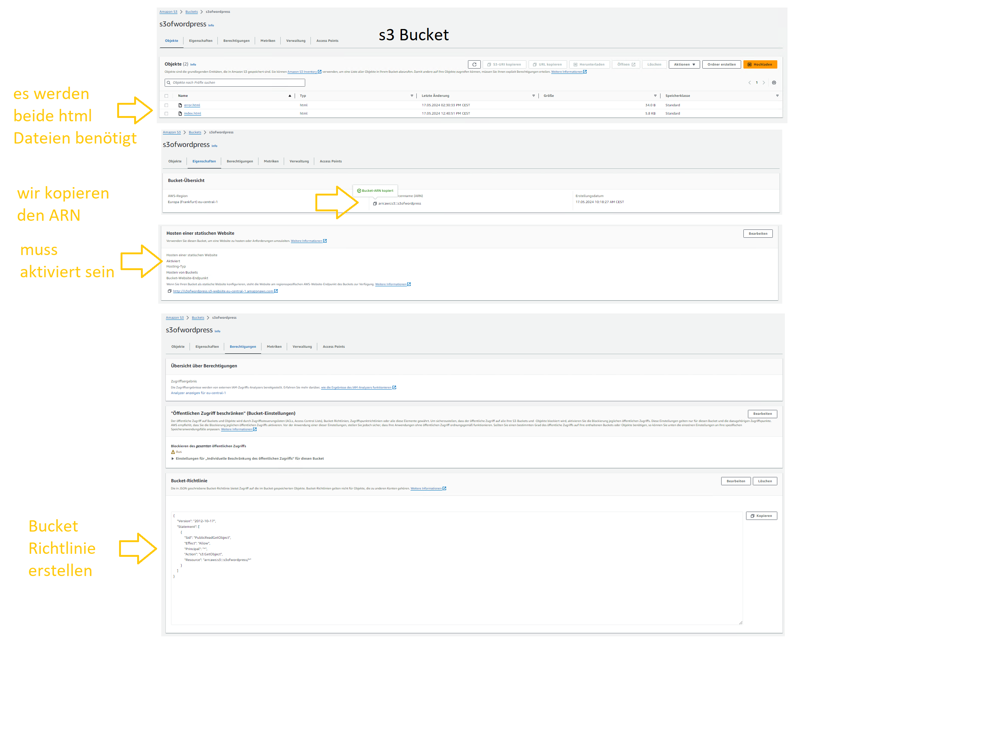

## [🌐s3-Bucket](https://docs.aws.amazon.com/AmazonS3/latest/userguide/Welcome.html)

    -   ist ein Online Speicher mächtiger als DropBox
    -   kann auch html online verfügbar machen

##   wir binden eine HTML im Bucket ein

## 

